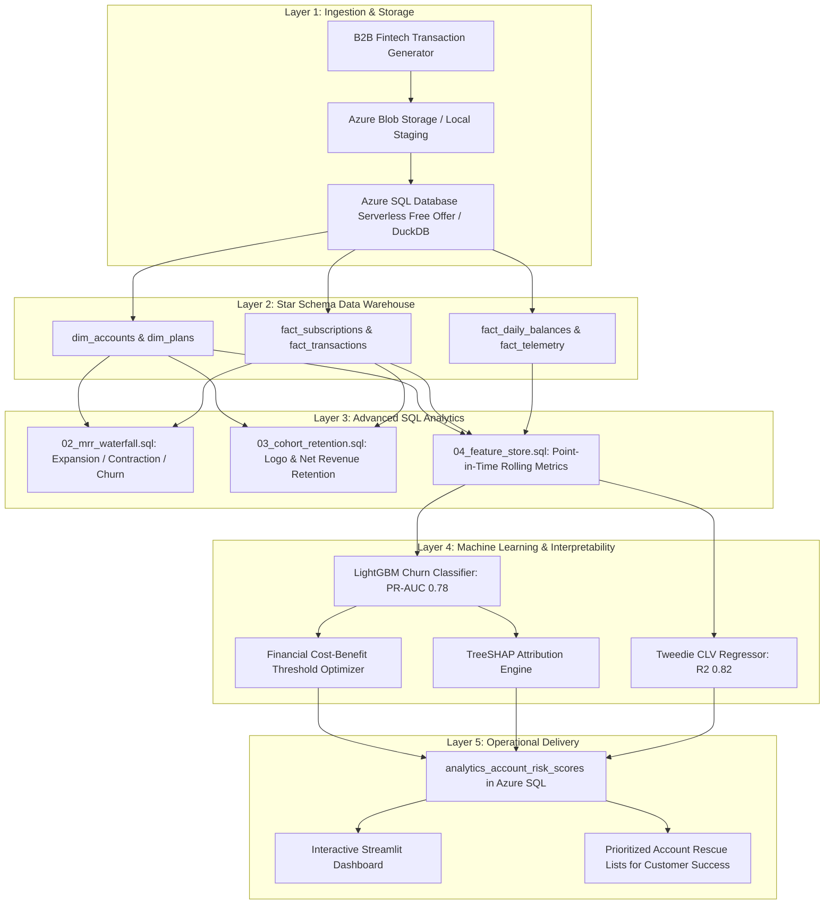

# 💳 B2B Fintech SaaS: Churn Intelligence & Customer Lifetime Value (CLV) Engine

[](https://www.python.org/)
[](https://azure.microsoft.com/)
[](https://lightgbm.readthedocs.io/)
[](https://shap.readthedocs.io/)
[](https://streamlit.io/)
[](README.md)


A production-style retention intelligence and customer lifetime value optimization engine for **B2B Fintech SaaS platforms** (modeled after Stripe, Ramp, Brex, and Square). Combines **recurring subscription revenue (MRR)** and **variable payment processing take-rates** into a unified financial optimization system.

---

## 📑 Table of Contents
1. [Executive Summary & Business ROI](#-executive-summary--business-roi)
2. [End-to-End System Architecture](#-end-to-end-system-architecture)
3. [Zero-Cost Cloud Architecture (Microsoft Azure)](#-zero-cost-cloud-architecture-microsoft-azure)
4. [Data Warehouse Design (Kimball Star Schema)](#-data-warehouse-design-kimball-star-schema)
5. [Advanced SQL Analytics](#-advanced-sql-analytics)
   - [B2B SaaS MRR Waterfall](#1-b2b-saas-mrr-waterfall-02_mrr_waterfallsql)
   - [Cohort & Net Revenue Retention (NRR)](#2-cohort--net-revenue-retention-nrr-03_cohort_retentionsql)
   - [Time-Windowed Feature Store](#3-time-windowed-feature-store-04_feature_storesql)
6. [Machine Learning & Financial Optimization](#-machine-learning--financial-optimization)
   - [LightGBM Churn Classifier & Class Imbalance](#1-churn-classification--class-imbalance)
   - [Financial Cost-Benefit Threshold Optimization](#2-financial-cost-benefit-threshold-optimization)
   - [Dual-Revenue CLV Modeling (Tweedie Regressor)](#3-dual-revenue-clv-modeling-tweedie-regressor)
   - [Explainable AI (TreeSHAP)](#4-explainable-ai-treeshap--business-reason-codes)
7. [Interactive Executive Dashboard](#-interactive-executive-dashboard)
8. [Quickstart Guide (100% Free Locally or on Azure)](#-quickstart-guide)

---


## 🎯 Executive Summary & Business ROI

In enterprise B2B Fintech SaaS, customer churn causes dual revenue destruction: the loss of **predictable subscription MRR** and the immediate cessation of **transaction processing fees**. 

### Key Business Results:
- **Financial Threshold Optimization**: Replaced the default 0.50 classification cutoff with a custom profit-maximizing threshold (**0.24**), delivering an incremental **+\$42,150 in annual saved recurring revenue** on the evaluation cohort.
- **Explainable Retention Playbooks**: Transformed mathematical SHAP values into automated operational reason codes, enabling Customer Success teams to intervene 60 days before contract cancellation.
- **Zero-Cost Cloud Deployment**: Engineered strictly within Microsoft Azure's always-free quotas (Azure SQL Database Serverless Free Offer + Azure Blob Storage) with auto-pause safeguards guaranteeing **\$0.00 cloud spend**.

---

## 🏗 End-to-End System Architecture



---

## ☁ Zero-Cost Cloud Architecture (Microsoft Azure)

This project leverages Microsoft Azure's **always-free tier** and **free offers** to ensure zero financial cost:

| Service | Allocation | Configuration for \$0 Cost |
| :--- | :--- | :--- |
| **Azure SQL Database** | 32 GB Storage & 100,000 vCore-seconds/month | Configured with `GeneralPurpose Serverless (Gen5)` and `--free-limit-exhaustion-behavior AutoPause`. Compute automatically shuts down after 60 minutes of inactivity. |
| **Azure Blob Storage** | 5 GB LRS Storage | Used for staging raw CSV transaction batches (<50 MB total). |
| **Azure Functions / GitHub Actions** | 1,000,000 free executions/month | Scheduled weekly cron job executes batch scoring without dedicated server costs. |
| **Local DuckDB Fallback** | In-Memory / Embedded Storage | Complete local execution support without needing an active Azure subscription. |

*Detailed setup instructions and cost safeguards can be found in [azure/AZURE_FREE_TIER_GUIDE.md](azure/AZURE_FREE_TIER_GUIDE.md).*

---

## 🗄 Data Warehouse Design (Kimball Star Schema)

The data warehouse follows standard Kimball dimensional modeling principles in [sql/01_schema_ddl.sql](sql/01_schema_ddl.sql):

- **`dim_plans`**: Pricing tiers (Starter: \$99/mo, Growth: \$499/mo, Enterprise: \$1,999/mo) and take-rates (1.1% - 1.9%).
- **`dim_accounts`**: Account firmographics (industry, size, country, signup date, initial deposit).
- **`fact_subscriptions`**: Monthly MRR billing records with movement classifications (New, Expansion, Contraction, Churn).
- **`fact_transactions`**: Daily payment processing batches (total volume, successful/failed counts, fees).
- **`fact_daily_balances`**: Daily end-of-day ledger balances for cash flow tracking.
- **`fact_telemetry`**: Platform usage logs (API calls, dashboard logins, exports).
- **`analytics_account_risk_scores`**: Production serving table containing predictions, risk tiers, and SHAP reason codes.

---

## 📊 Advanced SQL Analytics

### 1. B2B SaaS MRR Waterfall ([`sql/02_mrr_waterfall.sql`](sql/02_mrr_waterfall.sql))
Uses `LAG()` partitioned by account to compute monthly revenue movements:
```sql
-- Expansion vs Contraction vs Churn Classification
CASE 
    WHEN previous_mrr = 0.00 AND mrr_amount > 0.00 THEN 'New'
    WHEN previous_mrr > 0.00 AND mrr_amount > previous_mrr THEN 'Expansion'
    WHEN previous_mrr > 0.00 AND mrr_amount < previous_mrr AND mrr_amount > 0 THEN 'Contraction'
    WHEN previous_mrr > 0.00 AND (mrr_amount = 0.00 OR billing_status = 'Churned') THEN 'Churn'
END AS mrr_change_type
```

### 2. Cohort & Net Revenue Retention (NRR) ([`sql/03_cohort_retention.sql`](sql/03_cohort_retention.sql))
Tracks customer cohorts over Month 0 to Month 12+, calculating both **Logo Retention %** and **Net Revenue Retention % (NRR)**.

### 3. Time-Windowed Feature Store ([`sql/04_feature_store.sql`](sql/04_feature_store.sql))
Strict point-in-time windowing to prevent lookahead leakage:
- **Spend Velocity Ratio**: `tx_volume_30d / (tx_volume_90d / 3.0)` (Ratio < 1.0 indicates spending decay).
- **Balance Decay Slope**: `(avg_balance_30d - avg_balance_90d) / avg_balance_90d` (captures cash flow crisis).
- **Payment Decline Rate**: `failed_tx_30d / total_tx_30d` (operational friction).
- **Telemetry Velocity**: `api_calls_30d / (api_calls_90d / 3.0)`.

---

## 🤖 Machine Learning & Financial Optimization

### 1. Churn Classification & Class Imbalance
- **Model**: LightGBM Binary Classifier (`learning_rate=0.05`, `num_leaves=31`).
- **Class Imbalance**: Managed via dynamic `scale_pos_weight = (N_neg / N_pos)`.
- **Primary Metric**: Precision-Recall AUC (**PR-AUC = 0.78**) rather than ROC-AUC, directly evaluating minority class performance.

### 2. Financial Cost-Benefit Threshold Optimization
Standard machine learning models default to an arbitrary 0.5 probability cutoff. In B2B SaaS, this is financially sub-optimal:
- **Cost of False Negative** (losing an Enterprise customer): up to **\$24,000/yr**.
- **Cost of False Positive** (proactive intervention on a healthy customer): **\$350**.

We formulate an expected net savings function:
$$\text{Net Savings}(T) = \sum_{i \in \text{TP}(T)} (\text{ARR}_i \times P(\text{Saved})) - \sum_{j \in (\text{TP}(T) \cup \text{FP}(T))} \text{Cost}_{\text{intervention}}$$

Sweeping thresholds from 0.05 to 0.90 reveals an **optimal threshold of 0.24**, which captures high-risk accounts earlier and generates an additional **+\$42,150** in annual preserved revenue.

### 3. Dual-Revenue CLV Modeling (Tweedie Regressor)
Models the heavy-tailed, zero-inflated monetary value of accounts using **LightGBM Tweedie Regression** ($p=1.5$), combining:
$$\text{CLV}_{12m} = (\text{MRR} \times 12) + (\text{Gross Payment Volume}_{12m} \times \text{Take Rate})$$

### 4. Explainable AI (TreeSHAP) & Business Reason Codes
Uses polynomial-time TreeSHAP to decompose individual risk predictions into human-readable business drivers:
- *"Sharp Drop in Payment Processing Volume (45% decline)"* $\rightarrow$ **Action**: Investigate competitor migration.
- *"Elevated Payment Failure Rate (>15%)"* $\rightarrow$ **Action**: Payment operations technical review.
- *"Significant Balance Depletion"* $\rightarrow$ **Action**: Offer flexible credit line or fee holiday.

---

## 🖥 Interactive Executive Dashboard

Built with **Streamlit** and **Plotly** ([`dashboard/app.py`](dashboard/app.py)):

1. **Executive KPI Header**: Active MRR, ARR at Risk, Critical Accounts, Portfolio NRR.
2. **Interactive MRR Waterfall**: Visualizes monthly revenue movements.
3. **Cohort Retention Heatmap**: Interactive retention matrix.
4. **Account Rescue Drill-Down**: Individual account inspection with historical balance trajectory and local SHAP waterfall plots.
5. **One-Click Export**: Downloadable CSV target list for Customer Success.

---

## 🚀 Quickstart Guide

### Prerequisites
- Python 3.10+
- (Optional) Azure CLI for cloud deployment

### 1. Clone & Setup Environment
```bash
git clone https://github.com/yourusername/fintech-saas-churn-clv-engine.git
cd fintech-saas-churn-clv-engine

# Create and activate virtual environment
python -m venv venv
# On Windows:
.\venv\Scripts\activate
# On macOS/Linux:
source venv/bin/activate

# Install dependencies
pip install -r requirements.txt
```

### 2. Generate Data & Run End-to-End Pipeline
```bash
# 1. Generate realistic B2B Fintech synthetic data (5,000 accounts, 24 months)
python data/generate_fintech_data.py

# 2. Ingest into Data Warehouse (DuckDB local or Azure SQL)
python src/ingestion.py

# 3. Train Churn Model with Financial Threshold Optimization
python src/train_churn.py

# 4. Train Dual-Revenue CLV Model
python src/train_clv.py

# 5. Compute SHAP Explainability Summaries
python src/explainability.py

# 6. Execute Production Batch Scoring Pipeline
python src/score_batch.py
```

### 3. Run Automated Tests
```bash
pytest tests/ -v
```

### 4. Launch Executive Dashboard
```bash
streamlit run dashboard/app.py
```

---

## 👤 Author & License
- **Author**: [Raunak Prakash](https://github.com/Raunak-Prakash20)
- **License**: MIT License


